# 🪨 Hydraulic Rock Splitter

**B.Sc. Mechanical Engineering capstone project** at Pontificia Universidad Católica de Chile (Jul to Dec 2024), developed for the **Municipality of Puente Alto**, Santiago.

The goal was a portable **hydraulic wedge system** that breaks rock masses without explosives or heavy machinery. A hydraulic cylinder drives a wedge between two feathers inside a pre-drilled hole, and the lateral force splits the rock along a controlled line.

  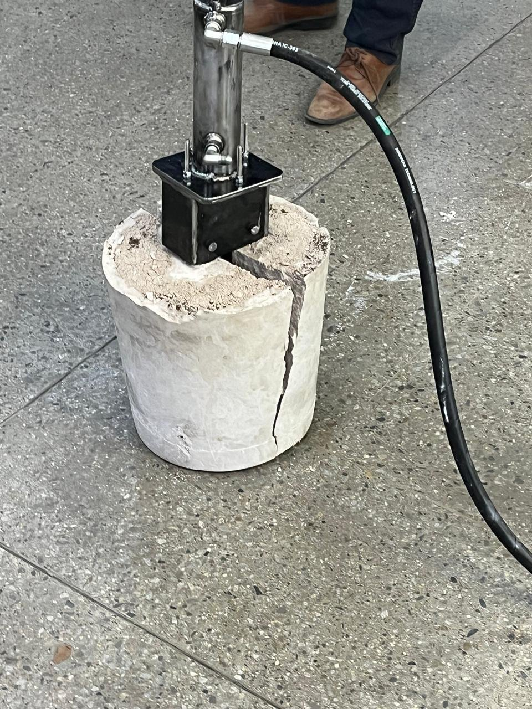
  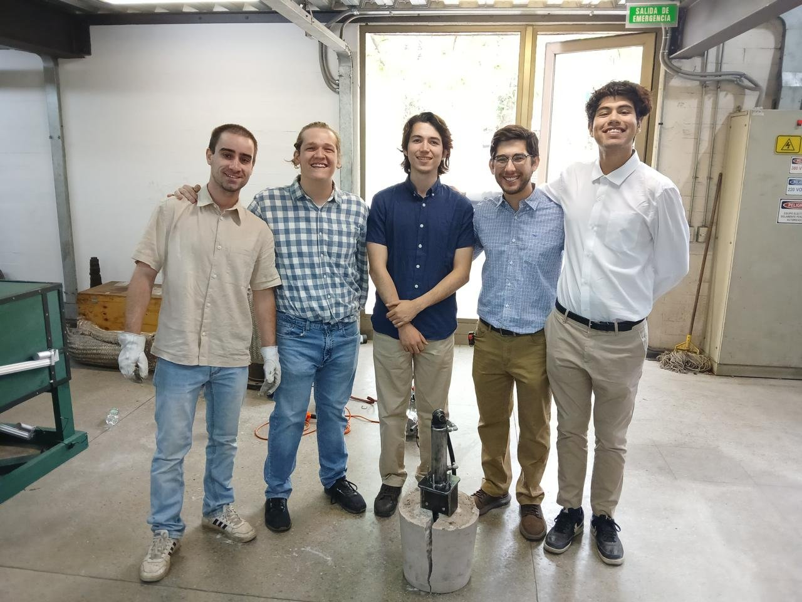
   <em>Left: a concrete test block split by the prototype during the final presentation. Right: the team.</em>

## 👤 My Role

Five-person team. A teammate and I carried most of the technical work. I was responsible for:

- 🔎 Preliminary research: rock mechanics, rock mass classification and existing splitting equipment
- 📐 Methodology and design of the wedge system
- 🧮 Engineering calculations
- 🖥️ CAD modeling (Autodesk Inventor) and FEA simulations
- 📋 Bill of materials
- 🏭 Manufacturing and assembly in the workshop

---

## 1. Design

The system has three main parts: an electric **hydraulic power unit**, a **hydraulic cylinder** with a custom flange, and the **wedge and feather** set that goes into the rock.

  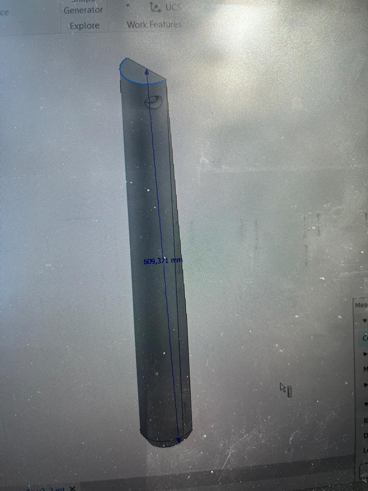
  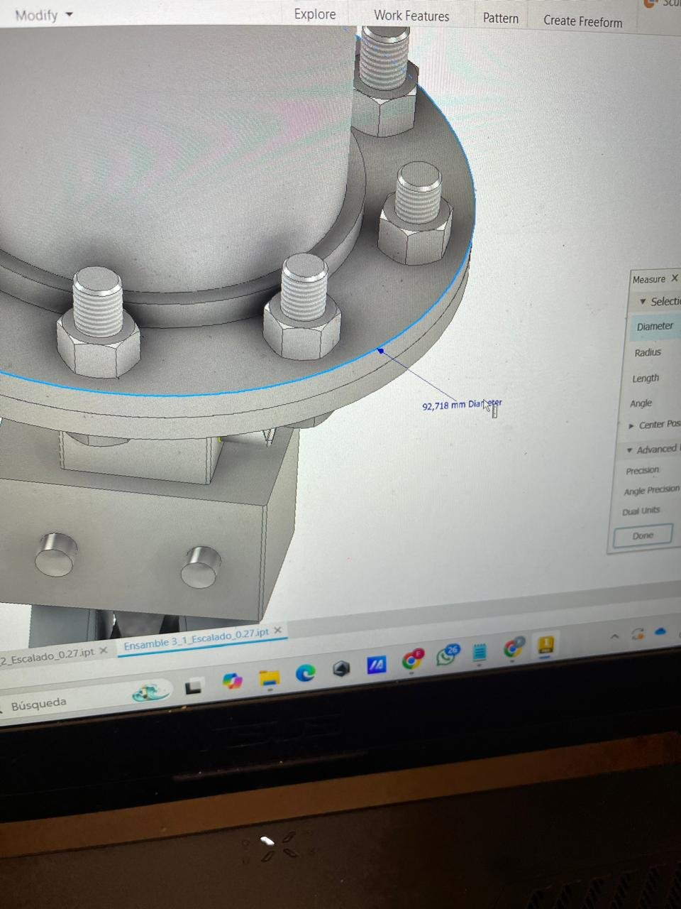
  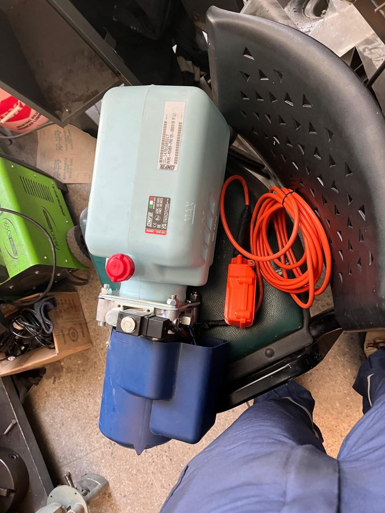

## 2. Simulation

I checked the critical components with **finite element analysis** (von Mises stress) before manufacturing, to verify that the wedge and its housing could carry the splitting load.

  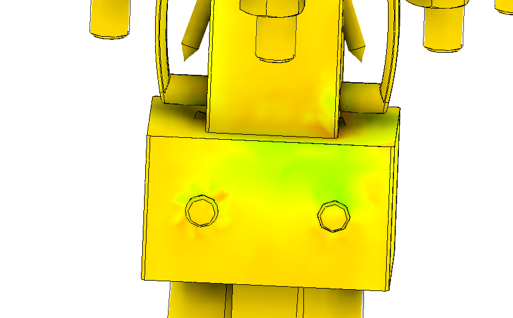
  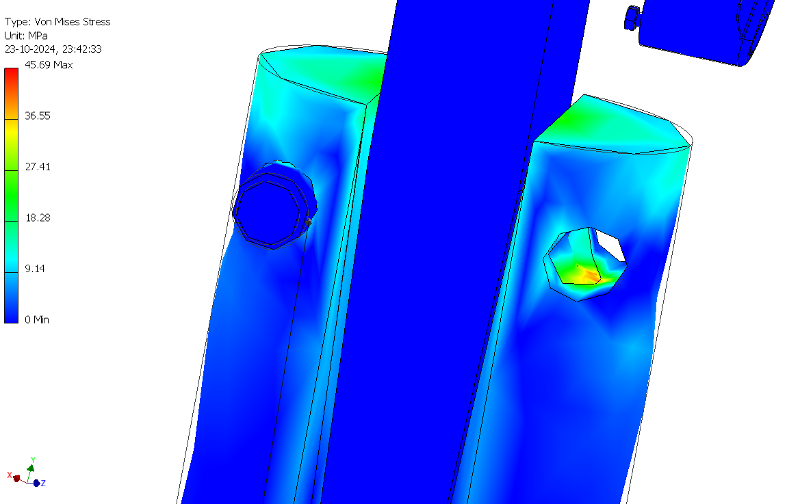

## 3. Bill of Materials

The full assembly was documented in a bill of materials that separates custom-made parts from purchased and standard parts (ISO/DIN fasteners, dowel pins).

  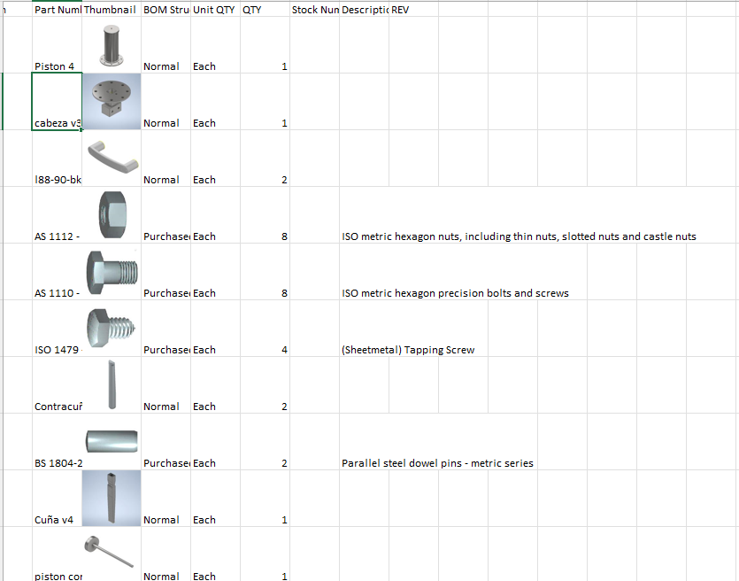

## 4. Manufacturing

Custom parts were cut, machined and assembled in the university workshop.

  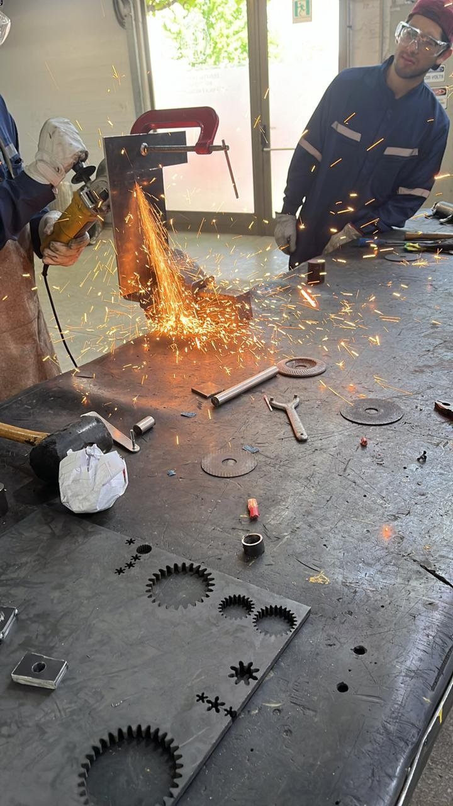
  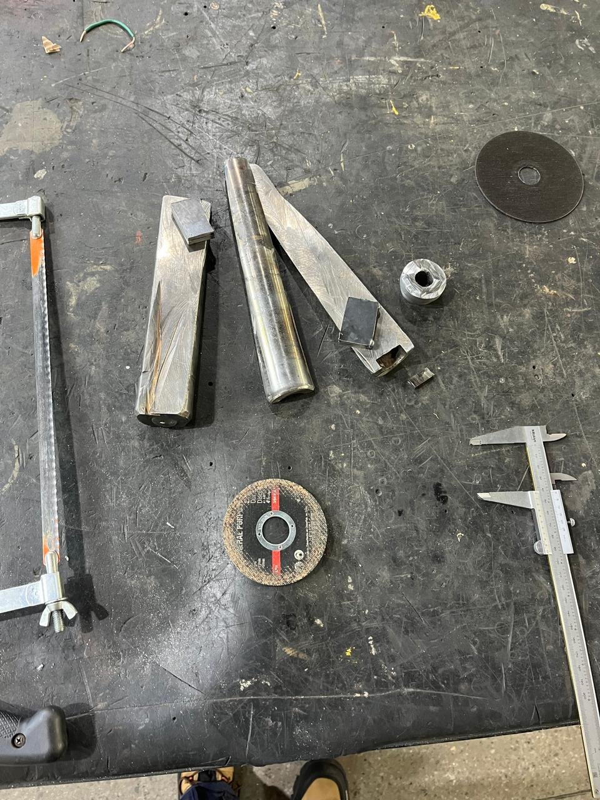
  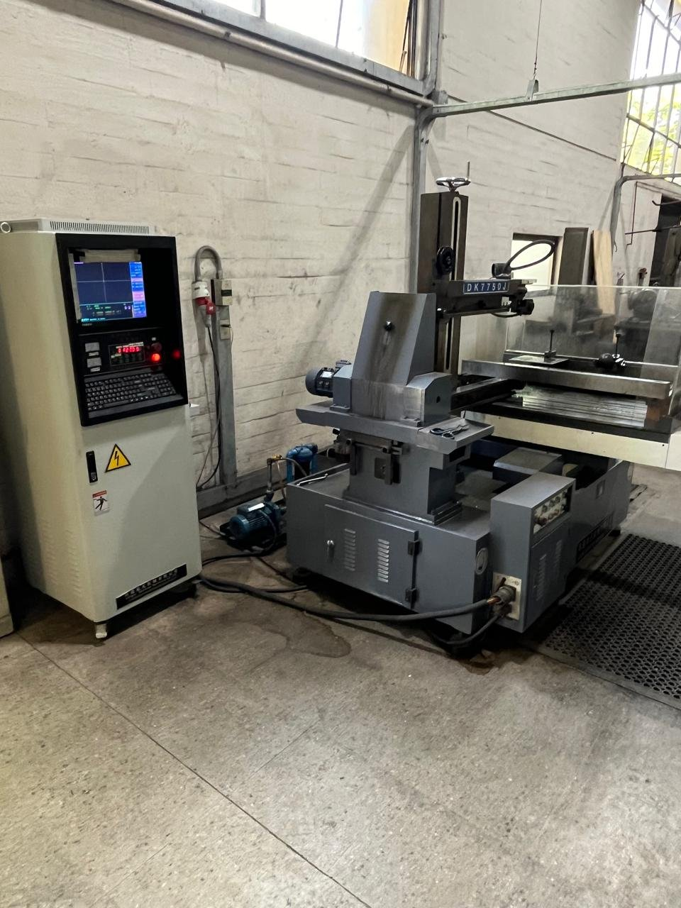

  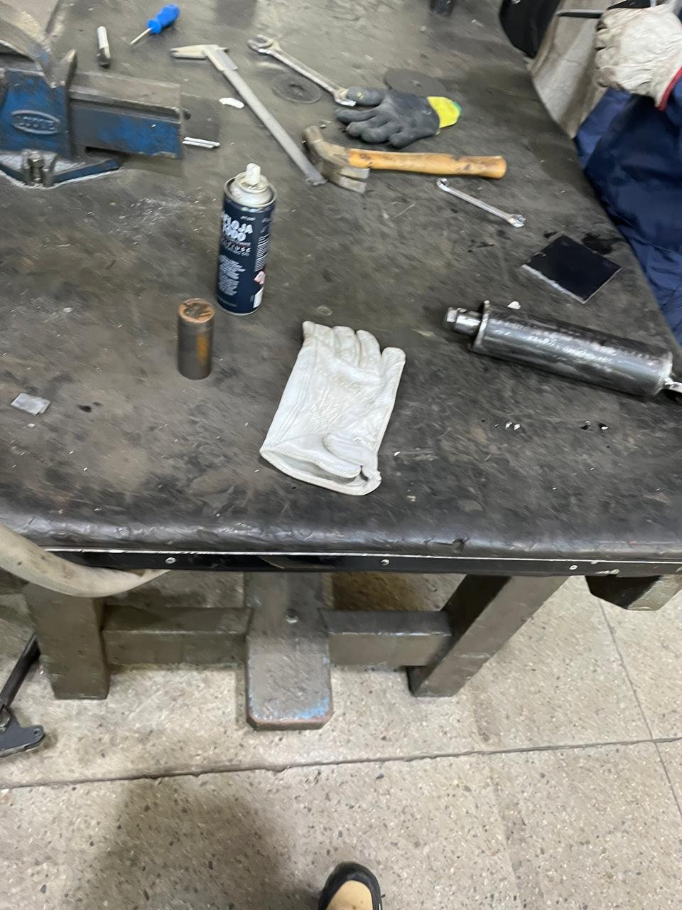
  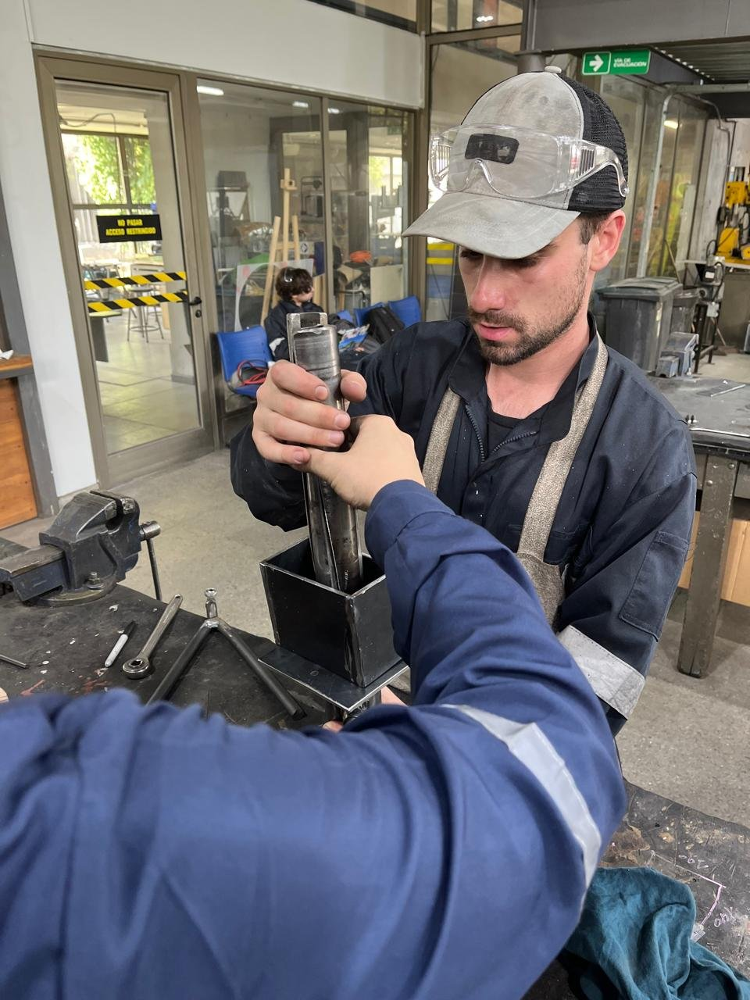
  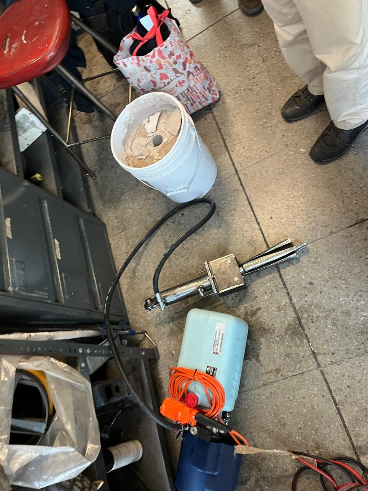

## 5. Testing

At the final presentation, the prototype was connected to the power unit and inserted into a concrete test block. **The block split along the wedge line**, validating the design.

---

## 🧰 Tools

> 📄 The full project report (design calculations, pressures and forces) will be added to this repository.
